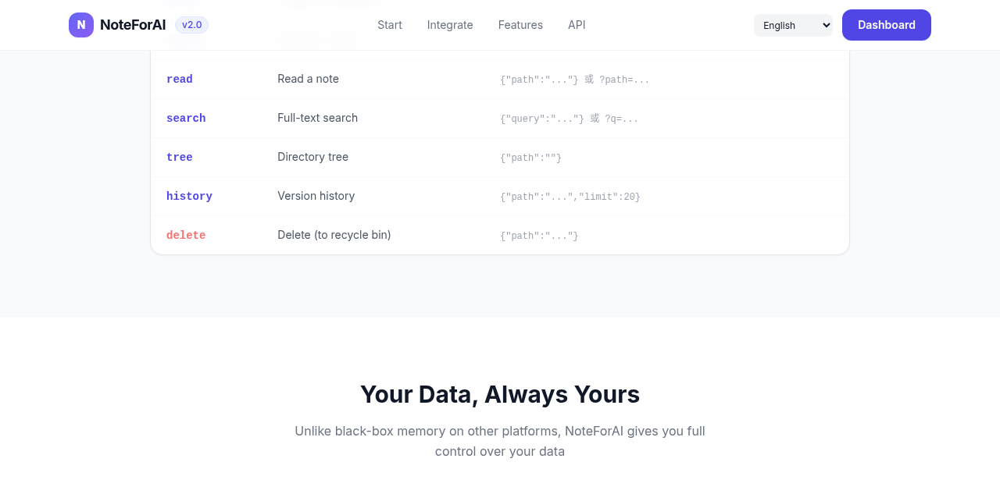
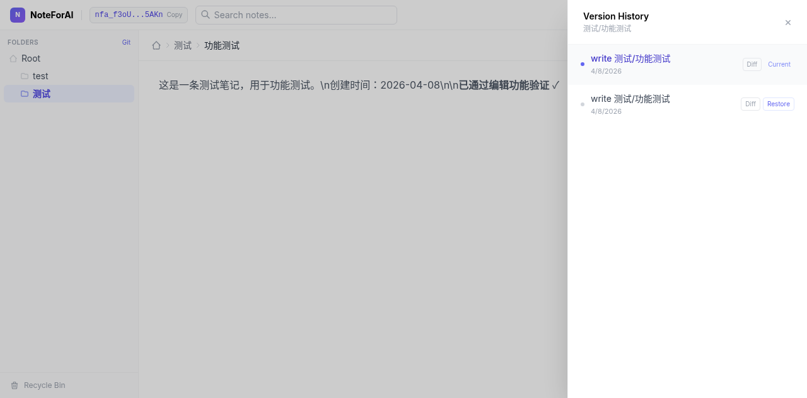
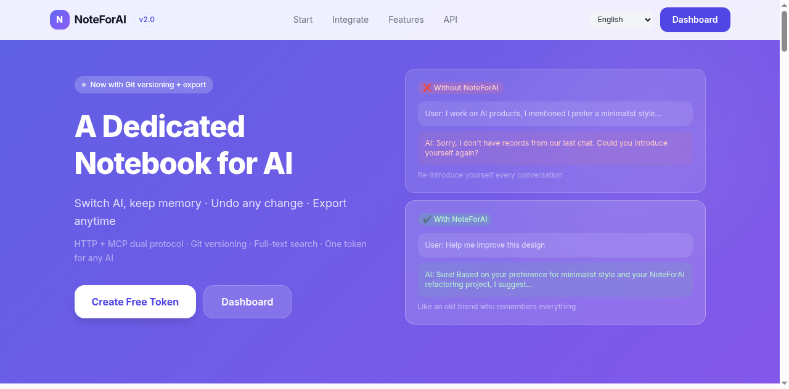

# NoteForAI

[English](README.md) · [简体中文](README_zh-CN.md) · [繁體中文](README_zh-TW.md) · [日本語](README_ja.md) · [한국어](README_ko.md) · [Español](README_es.md) · [Français](README_fr.md) · [Deutsch](README_de.md) · [Português](README_pt-BR.md) · [Русский](README_ru.md)

**Give your AI a notebook that never forgets.**

[](LICENSE)
[](https://go.dev)
[](https://modelcontextprotocol.io)
[]()

> **Try it free** → [noteforai.com](https://noteforai.com) · No signup, no install, one click to get a token.

---


---

## The Problem

Every AI conversation starts from scratch. Your AI forgets your preferences, loses project context, and makes you repeat yourself — every single time.

```
You: "I'm a backend engineer, I prefer Go, and I'm working on NoteForAI..."
AI:  "Got it! How can I help?"

[Next conversation]

You: "Help me with the API design"
AI:  "Sure! Could you tell me a bit about your project first?"  ← 😤
```

## The Solution

NoteForAI gives any AI a persistent, structured notebook. Works across conversations, tools, and devices.


---

## Quick Start — 30 Seconds

No signup. No install. Just run:

```bash
# 1. Get your token
TOKEN=$(curl -s -X POST https://noteforai.com/create_token | grep -o '"token":"[^"]*"' | cut -d'"' -f4)
echo "Your token: $TOKEN"

# 2. Save something about yourself
curl -X POST "https://noteforai.com/$TOKEN/write" \
  -H 'Content-Type: application/json' \
  -d '{"path":"me/profile.md","content":"# About Me\n\nRole: Backend Engineer\nPrefers: Go, clean code, dark themes\nCurrent project: NoteForAI"}'

# 3. Your AI now remembers you — across every conversation ✓
```

Then paste this into your AI's system prompt (replace `YOUR_TOKEN`):

```
You have persistent memory via NoteForAI.
API: https://noteforai.com/YOUR_TOKEN/
Start each conversation with: read("me/profile.md")
Record preferences and context with write() or append().
```

Or use **MCP** for a native tool experience (see below).

---

## Core Features

| Feature | Description |
|---------|-------------|
| 📝 **File-system API** | write, read, append, delete, list, tree, search |
| 🔍 **Full-text search** | Bleve engine with CJK + multilingual support |
| 🔀 **Git versioning** | Every write auto-snapshotted — history, diff, revert |
| 🌐 **Dual protocol** | HTTP API + MCP (Streamable HTTP or stdio) |
| 🔒 **Multi-tenant** | Token-based isolation, no accounts needed |
| 📦 **Export** | ZIP / JSON anytime, no vendor lock-in |
| 🏠 **Self-hostable** | Single Go binary, no database required |
| 🌍 **18 languages** | Built-in i18n in the web UI |

---

## MCP Integration (Recommended)

The cleanest way to give Claude or any MCP-compatible AI persistent memory.



### Claude Desktop / Claude Code

**Hosted service** — Streamable HTTP, no install needed:

```json
{
  "mcpServers": {
    "noteforai": {
      "type": "http",
      "url": "https://noteforai.com/YOUR_TOKEN/mcp"
    }
  }
}
```

**Claude Code CLI:**
```bash
claude mcp add noteforai --transport http https://noteforai.com/YOUR_TOKEN/mcp
```

**Self-hosted** — stdio transport:
```json
{
  "mcpServers": {
    "noteforai": {
      "command": "/path/to/noteforai",
      "args": ["mcp", "YOUR_TOKEN"]
    }
  }
}
```

MCP tools available: `write`, `read`, `append`, `delete`, `list`, `tree`, `search`, `history`, `diff`, `revert`, `deleted` (11 total).

---

## Git Version History

Every write and append is automatically snapshotted. Browse, diff, and restore from the dashboard.



```bash
# View history
curl "https://noteforai.com/$TOKEN/history?path=me/profile.md"

# See what changed
curl "https://noteforai.com/$TOKEN/diff?path=me/profile.md&commit=abc12345"

# Restore to a previous version
curl -X POST "https://noteforai.com/$TOKEN/revert" \
  -d '{"path":"me/profile.md","commit":"abc12345"}'
```

---

## Use Cases

**🖥 Claude Code / Cursor / Windsurf**
AI remembers your coding style, project architecture decisions, and preferred patterns across every session.

**🤖 Autonomous AI Agents**
Agents accumulate knowledge over long-running tasks instead of starting cold every run.

**👤 Personal AI Assistant**
Store preferences, goals, contacts, project context — your AI knows you like an old friend.

---

## Web Dashboard



Built-in file-manager UI at `/dashboard.html`:
- Browse, create, edit, and preview (Markdown rendered) notes
- Live full-text search
- Version history with one-click restore
- Export all notes as ZIP or JSON
- Recycle bin for deleted files

---

## Self-Hosting

Full control over your data. Single binary, no database.

```bash
# Build and run
go build -o noteforai .
./noteforai serve

# Or Docker
docker compose up --build
```

| Variable | Default | Description |
|----------|---------|-------------|
| `PORT` | `8080` | Listen port |
| `DATA_DIR` | `./data` | Data storage directory |
| `QUOTA_MB` | `0` | Per-token disk quota in MB (0 = unlimited) |
| `TRASH_DAYS` | `30` | Soft-delete retention days |

Deploy on any VPS, Fly.io, Railway, or Render. See [fly.toml](fly.toml) for Fly.io config.

---

## API Reference

All endpoints accept both `GET` (query params) and `POST` (JSON body).

| Endpoint | Params | Description |
|----------|--------|-------------|
| `POST /create_token` | — | Create a new token |
| `/{token}/write` | `path`, `content` | Create or overwrite a file |
| `/{token}/read` | `path` | Read a file |
| `/{token}/append` | `path`, `content` | Append to a file |
| `/{token}/delete` | `path` | Delete a file or directory (soft) |
| `/{token}/list` | `path` | List directory contents |
| `/{token}/tree` | `path` | Recursive directory tree |
| `/{token}/search` | `query`, `path` | Full-text search |
| `/{token}/history` | `path`, `limit` | Git version history |
| `/{token}/diff` | `path`, `commit` | View a specific commit diff |
| `/{token}/revert` | `path`, `commit` | Restore file to a version |
| `/{token}/deleted` | `limit` | List recoverable deleted files |
| `/{token}/destroy` | — | Delete token and all data |
| `/{token}/mcp` | — | MCP Streamable HTTP endpoint |

HTTP status codes: `201` created · `200` ok · `404` not found · `401` invalid token · `413` quota exceeded

---

## Architecture

```
main.go           Entry point — CLI (serve / mcp <token>)
api/http.go       HTTP API + request logging + 10MB body limit
api/mcp.go        MCP server (Streamable HTTP + stdio)
store/store.go    Core: file ops + Indexer interface + per-path locks + quota
store/git.go      Git-based version control (go-git)
index/bleve.go    Full-text search — Bleve + CJK bigram tokenizer
token/token.go    Token generation (nfa_ prefix + 32 random chars)
api/ui/           Embedded web UI — 18 languages, zero build step
```

Data layout:
```
data/
  files/{token}/    User files (plain Markdown)
  index/            Bleve full-text index
```

---

## Contributing

PRs welcome. Run tests before submitting:

```bash
go test ./... -v -race
go vet ./...
```

---

## License

[MIT](LICENSE) — use it, fork it, self-host it.
