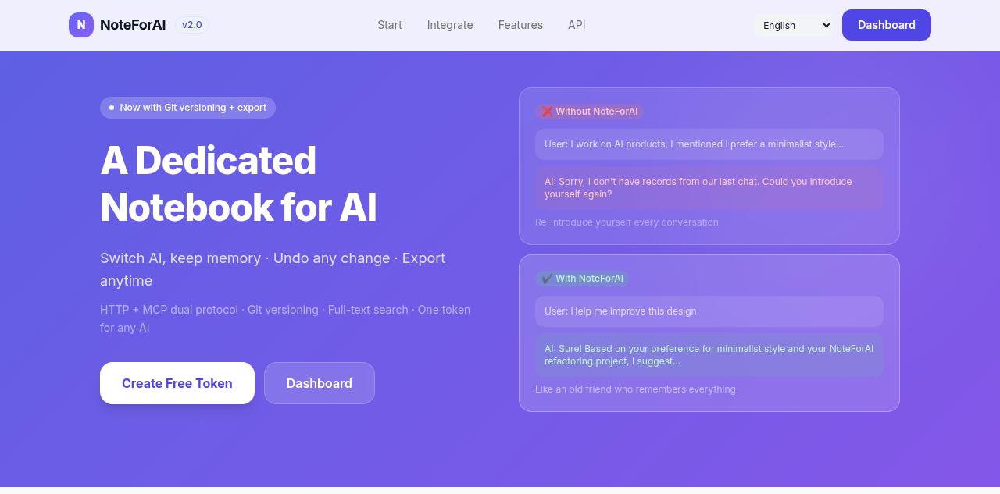
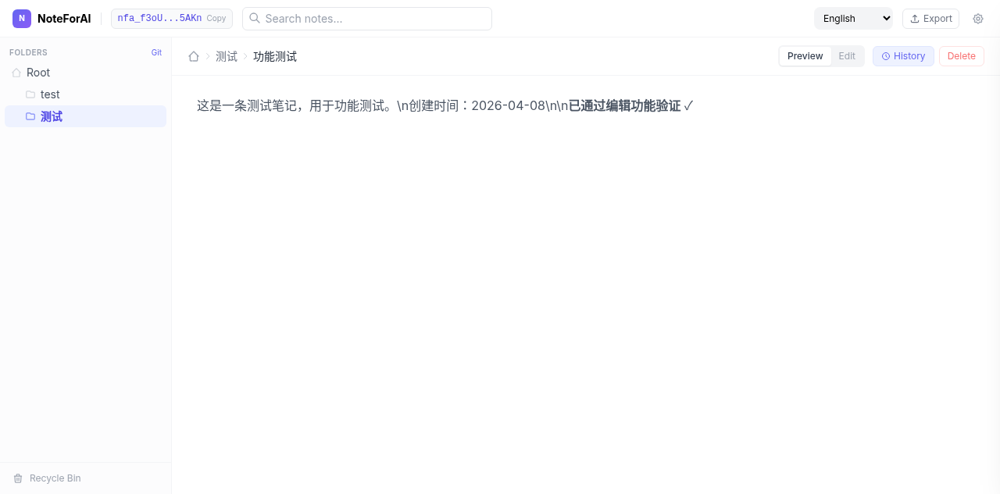

# NoteForAI

[English](README.md) · [简体中文](README_zh-CN.md) · [繁體中文](README_zh-TW.md) · [日本語](README_ja.md) · [한국어](README_ko.md) · [Español](README_es.md) · [Français](README_fr.md) · [Deutsch](README_de.md) · [Português](README_pt-BR.md) · [Русский](README_ru.md)

**Geben Sie Ihrer KI ein Notizbuch, das niemals vergisst.**

[](LICENSE)
[](https://go.dev)
[](https://modelcontextprotocol.io)
[]()

> **Kostenlos ausprobieren** → [noteforai.com](https://noteforai.com) · Keine Registrierung, Token in einem Klick.

---



---

## Das Problem

Jedes KI-Gespräch beginnt von vorn. Ihre KI vergisst Ihre Präferenzen, verliert den Projektkontext und lässt Sie alles wiederholen — jedes Mal.

## Die Lösung

NoteForAI gibt jeder KI einen dauerhaften, strukturierten Notizbereich. Funktioniert gesprächsübergreifend, toolübergreifend und geräteübergreifend.



---

## Schnellstart — 30 Sekunden

```bash
# 1. Token erhalten
TOKEN=$(curl -s -X POST https://noteforai.com/create_token | grep -o '"token":"[^"]*"' | cut -d'"' -f4)

# 2. Informationen über sich speichern
curl -X POST "https://noteforai.com/$TOKEN/write" \
  -H 'Content-Type: application/json' \
  -d '{"path":"ich/profil.md","content":"# Über mich\n\nRolle: Backend-Entwickler\nPräferenzen: Go, sauberer Code"}'

# 3. Ihre KI erinnert sich jetzt an Sie ✓
```

Fügen Sie dies in den System-Prompt Ihrer KI ein（`YOUR_TOKEN` ersetzen）：

```
Sie verfügen über ein dauerhaftes Gedächtnissystem namens NoteForAI. Nutzen Sie es, um alles über den Benutzer zu merken.
API: https://noteforai.com/YOUR_TOKEN/
Aufruf: POST + JSON body

Richtlinien:
1. Zu Beginn jedes Gesprächs read("ich/profil.md") ausführen
2. Wertvolle Informationen aktiv erfassen（Präferenzen, Projektfortschritt, wichtige Entscheidungen）
3. Alle Dateien mit .md-Endung, thematisch in Verzeichnissen organisieren
```

---

## MCP-Integration（Empfohlen）

### Claude Desktop / Claude Code

**Gehosteter Dienst** — Streamable HTTP, keine Installation：

```json
{
  "mcpServers": {
    "noteforai": {
      "type": "http",
      "url": "https://noteforai.com/YOUR_TOKEN/mcp"
    }
  }
}
```

**Claude Code CLI：**
```bash
claude mcp add noteforai --transport http https://noteforai.com/YOUR_TOKEN/mcp
```

---

## API-Referenz

Alle Endpunkte unterstützen `GET`（Abfrageparameter）und `POST`（JSON body）.

| Endpunkt | Parameter | Beschreibung |
|----------|-----------|--------------|
| `POST /create_token` | — | Neuen Token erstellen |
| `/{token}/write` | `path`、`content` | Datei erstellen oder überschreiben |
| `/{token}/read` | `path` | Datei lesen |
| `/{token}/append` | `path`、`content` | Inhalt an Datei anhängen |
| `/{token}/delete` | `path` | Datei oder Verzeichnis löschen（Soft-Delete）|
| `/{token}/list` | `path` | Verzeichnisinhalt auflisten |
| `/{token}/tree` | `path` | Rekursiver Verzeichnisbaum |
| `/{token}/search` | `query`、`path` | Volltextsuche |
| `/{token}/history` | `path`、`limit` | Git-Versionshistorie |
| `/{token}/diff` | `path`、`commit` | Änderungen eines bestimmten Commits anzeigen |
| `/{token}/revert` | `path`、`commit` | Datei auf eine Version zurücksetzen |
| `/{token}/deleted` | `limit` | Wiederherstellbare gelöschte Dateien |
| `/{token}/destroy` | — | Token und alle Daten löschen |
| `/{token}/mcp` | — | MCP Streamable HTTP-Endpunkt |

HTTP-Statuscodes：`201` erstellt · `200` erfolgreich · `404` nicht gefunden · `401` Token ungültig · `413` Kontingent überschritten

---

## Selbst-Hosting

```bash
go build -o noteforai .
./noteforai serve
# Oder mit Docker
docker compose up --build
```

| Variable | Standard | Beschreibung |
|----------|----------|--------------|
| `PORT` | `8080` | Lauschport |
| `DATA_DIR` | `./data` | Datenspeicherverzeichnis |
| `QUOTA_MB` | `0` | Festplattenkontingent pro Token（MB, 0=unbegrenzt）|
| `TRASH_DAYS` | `30` | Aufbewahrungsdauer für Soft-Delete |

---

## Lizenz

[MIT](LICENSE)
